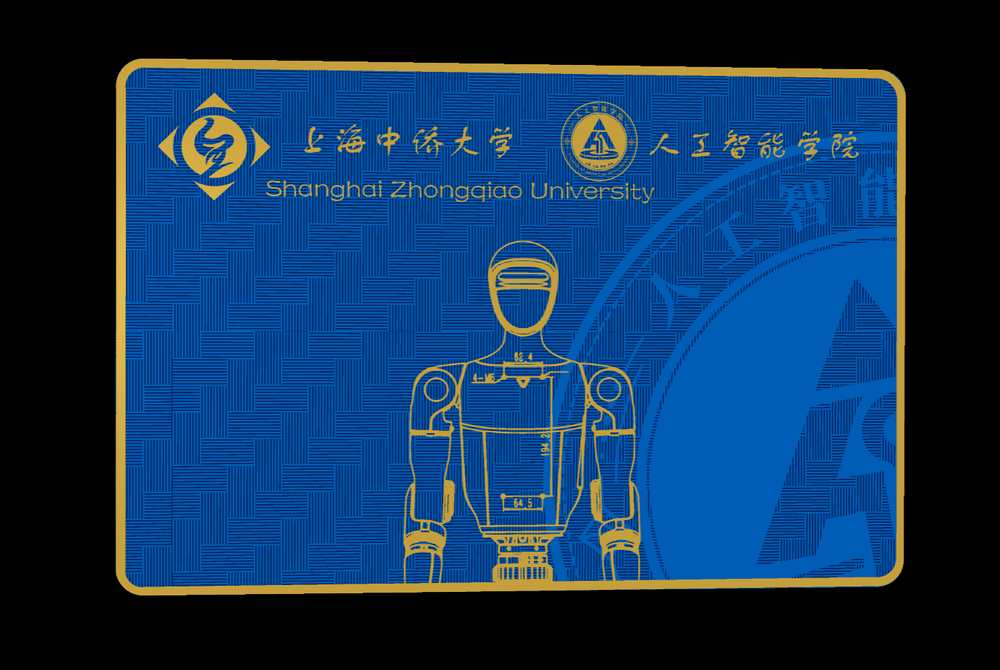
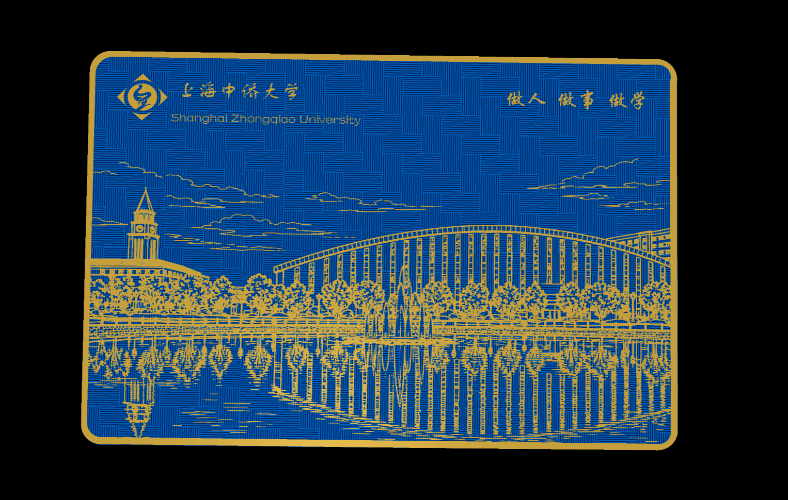
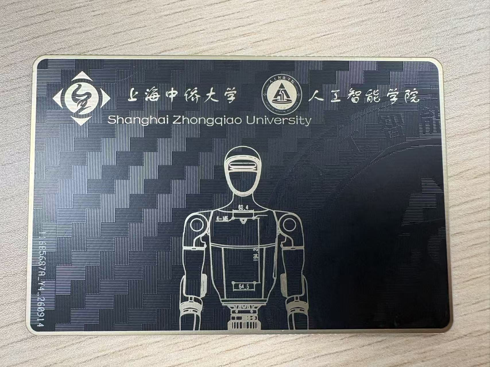
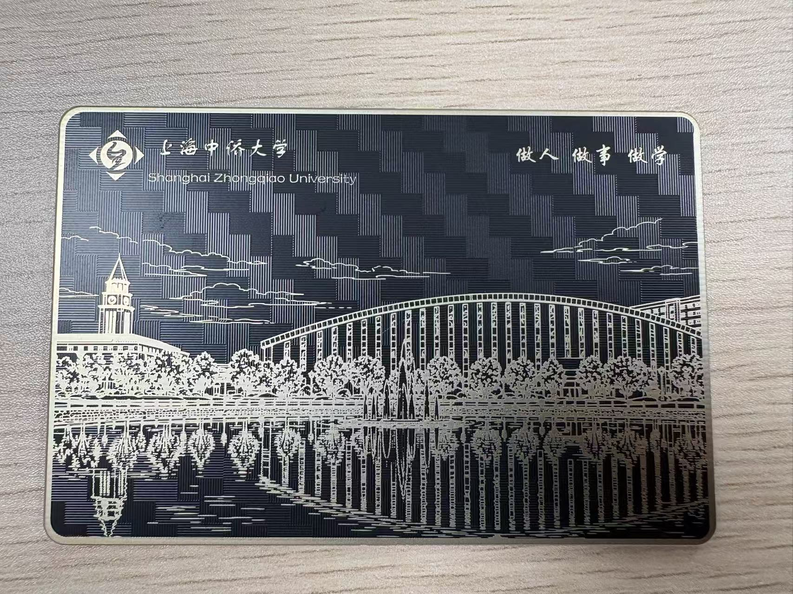

# 校园卡 · Campus Card

上海中侨大学 **人工智能学院** 校园卡 PCB 设计。





## 成品实拍

实物：深蓝阻焊 + 沉金。





---

## 设计

| 项目 | 参数 |
| --- | --- |
| 学校 | 上海中侨大学 |
| 学院 | 人工智能学院 |
| 设计工具 | EasyEDA Pro v3.2.186 |
| 导出日期 | 2026-09-14 |
| 板层 | 2 层 |
| 板尺寸 | 85.60 × 56.98 mm |
| 圆角 | R 3.0 mm |
| 外形线宽 | 0.254 mm |
| Gerber 格式 | RS-274X，单位 mm，坐标格式 4.5 |

**正面**：校徽 + 学院名称，中部为电路风格的机器人线稿，底纹用交错短走线填充，右侧叠加学校建筑剪影。

**背面**：校园景观线稿（钟楼 + 图书馆拱廊），带水面倒影，底纹同样为走线纹理。

两面的图形全部做在**铜层 + 阻焊开窗**上，不使用丝印层 —— 成品观感完全由板面工艺（阻焊配色 / 表面处理）决定。丝印层文件为空白属正常。

## 文件结构

```
.
├── gerber/
│   └── Gerber_PCB1_2026-09-14.zip    # 嘉立创下单用 Gerber 包
├── images/
│   ├── card-front.png                # 正面效果图
│   └── card-back.png                 # 背面效果图
├── video/
│   └── campus-card-demo.mp4          # 成品演示视频
└── README.md
```

## Gerber 包内容

| 文件 | 说明 |
| --- | --- |
| `Gerber_BoardOutlineLayer.GKO` | 板框外形 |
| `Gerber_TopLayer.GTL` | 顶层铜 |
| `Gerber_BottomLayer.GBL` | 底层铜 |
| `Gerber_TopSolderMaskLayer.GTS` | 顶层阻焊 |
| `Gerber_BottomSolderMaskLayer.GBS` | 底层阻焊 |
| `Gerber_TopSilkscreenLayer.GTO` | 顶层丝印（空层） |
| `Gerber_BottomSilkscreenLayer.GBO` | 底层丝印（空层） |
| `Gerber_DrillDrawingLayer.GDD` | 钻孔参考图 |
| `FlyingProbeTesting.json` | 飞针测试点配置 |
| `PCB下单必读.txt` | 嘉立创下单说明 |

> 本设计无过孔、无插件孔，所以包内没有独立的 NC Drill 文件，整包直接上传下单即可。

## 下单流程

1. 打开 [嘉立创 PCB 下单](https://www.jlc.com/)，上传 `gerber/Gerber_PCB1_2026-09-14.zip`
2. 板厚 `1.6 mm`
3. 表面处理建议 `沉金` —— 图形全部是铜面，沉金对金色线稿的还原度最好
4. 阻焊颜色按效果图选深蓝

参考文档：[EasyEDA Pro PCB 下单流程](https://prodocs.lceda.cn/cn/pcb/order-order-pcb/index.html)

## 备注

板框实测 `85.60 × 56.98 mm`。ISO ID-1 标准卡尺寸为 `85.60 × 53.98 mm` —— 宽度完全一致，高度多出 3 mm。若要塞进标准卡套 / 卡包，投板前需要确认。
